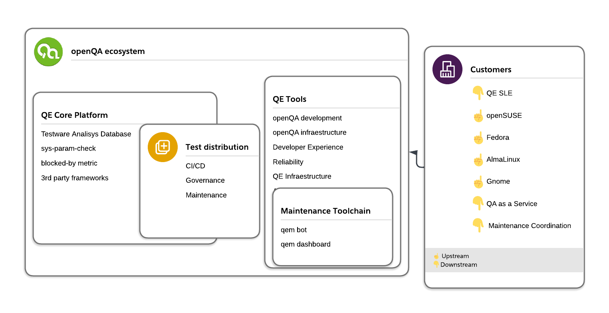

## Scope
* Who we are
* current state
* moving forward
* collaborate and contribute

Note:
openQA is one of the key elements that ensures the delivery of updates and new
versions of operating systems, it is the heart of openSUSE's effort to deliver
stable systems for our users, and SUSE's quality gate, used to ensure that
updates and new releases of the operating systems aren't breaking operations
of customers; however it is growing outside openSUSE, Fedora and SUSE,
expanding to other distributions, so we need to start thinking how to
collaborate further, and have a clearer picture for users of openQA's
ecosystem and integration capabilities.

Santiago Zarate is the Product Owner of Quality Engineering Core team at SUSE,
they collaborate closely with the Quality Engineering Tools Team and rest of
the teams of the Quality Engineering department

---

## Who we are

"The easiest way to provide complete quality for your software"

https://progress.opensuse.org/projects/qa/wiki/

* Two teams, 8+9 SUSE employees
* Part of QE for openSUSE+SUSE products
* Working for SUSE and with communities

---

## current state

Let's just take a look on
https://openqa.opensuse.org
:)

Note:
The speaker will give a quick overview of features, challenges and
opportunities for further development

---

## moving forward

Note:
wants to provide a window
into how to close the gap between users outside of openSUSE/SUSE and the
openQA development team

---

## collaborate and contribute

* http://open.qa/
* https://v.gd/osado
* https://gitlab.gnome.org/GNOME/openqa-tests/-/wikis/QA-testing-monthly-call
Note:
To know more about openQA - Talk: Shortening the feedback loops between R&D
See https://youtu.be/3HN61L7RzzA?si=cFKT5JkujLc-w3_n

---

## Points to take away

* openQA is actively used and developed
* tests/tooling/integration are of high value themselves
* multiple communities already collaborate
* if you need more, talk to us :)

---

### The end … Questions? Corrections? Additions?

https://v.gd/okurz_osc24

<small>
Presentation created using  <a href="https://github.com/krig/opensuse-presentation-template">https://github.com/krig/opensuse-presentation-template</a>
</small>

#### License
<small>
This slide deck is licensed under the Creative Commons Attribution-ShareAlike 4.0 International license.
It can be shared and adapted for any purpose (even commercially) as long as Attribution is given and any derivative work is distributed under the same license. Details can be found at <a href="https://creativecommons.org/licenses/by-sa/4.0/">https://creativecommons.org/licenses/by-sa/4.0/</a>
</small>
